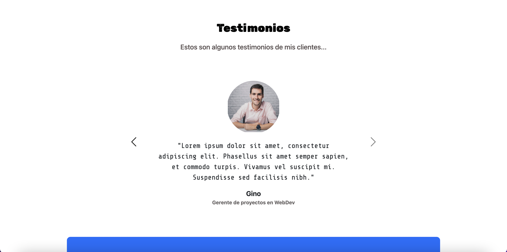

# Portafolio Briseidy Joselin Espinoza Espinosa con Bootstrap 5

Este proyecto creado para el bootcamp Tecnolochicas PRO, es una página web donde se anexan una descripción breve de su motivación, experiencia, proyectos, artículos publicados y formas de contacto. 

### Capturas de pantalla:

Primera parte de la página web:

Experiencia:

Proyectos:

Testimonios:

Contacto:

## Tecnologías

Esta página web fue creada con:

* HTML
* CSS
* JavaScript 
* Bootstrap 5

Además, se incluyeron **Google Fonts** para personalizar la fuente y **Bootstrap icons** para incorporar íconos como flechas y logos de redes sociales populares. 

## Español

El texto de la página web está escrito en español, al igual que las clases y atributos personalizados. Las clases relacionadas con Bootstrap se incluyeron en inglés.

